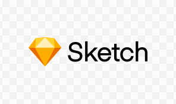

My first blog post! 

I've always been interested in the web world, I love design, and I've been spending a lot of my free time working through [Colt Steele's](https://www.udemy.com/user/coltsteele/) Udemy course, [The Web Developer Bootcamp](https://www.udemy.com/course/the-web-developer-bootcamp/).

I have an idea for an application I'd like to create. The concept is simple; create an intuitive application where multiple users can work together to complete routine chores. I'd like to call it -- WeClean. I've been brainstorming and writing down all of the feature I'd like to create for it, and it will have to be done in stages. I'm debating at the moment of which frameworks to use. I've learned through the online bootcamp how to create an application with the Express framework (NodeJS) and MongoDB, however I'm not sure if I should try something new. I'd like to focus on learning some new Front-End technology eventually, specifically ReactJS seems to be a good Javascript Framework to move towards.

I've started the wireframes for WeClean using [Sketch](https://www.sketch.com/) and I must admit, I'm really liking this program. It feels simple and intuitive (not to mention the UI is super sleek). I'll post some of the screenshots once I have finished V1. I'm excited to be starting this project. I still work a full time job at the moment so unfortunately my progress may be slow, but I'll post as often as I can!

