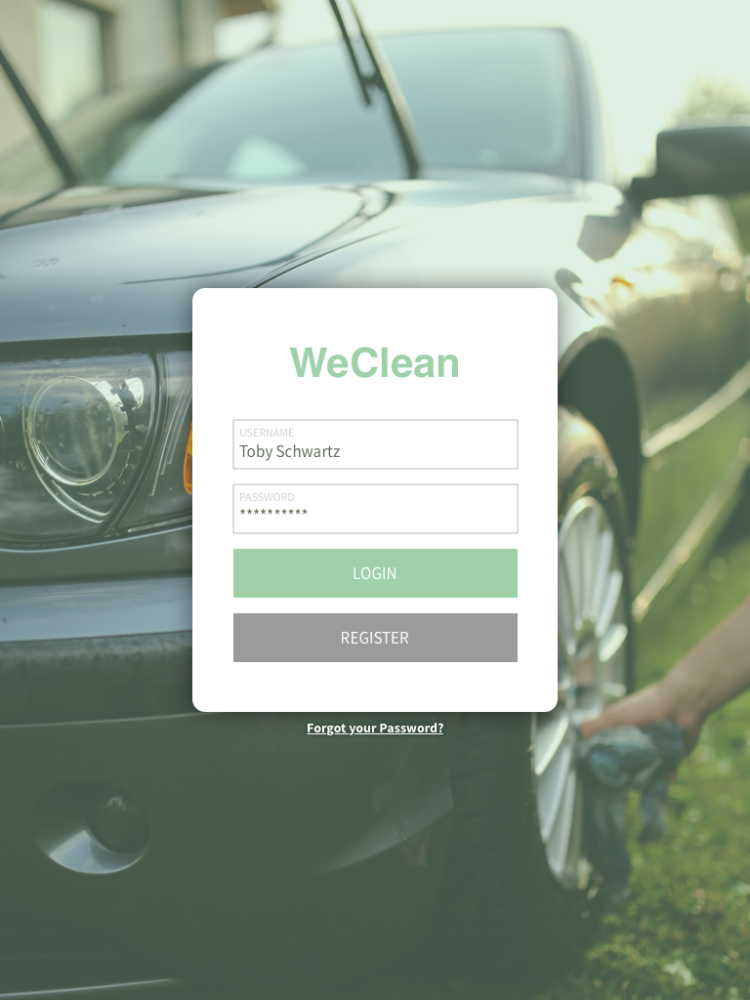
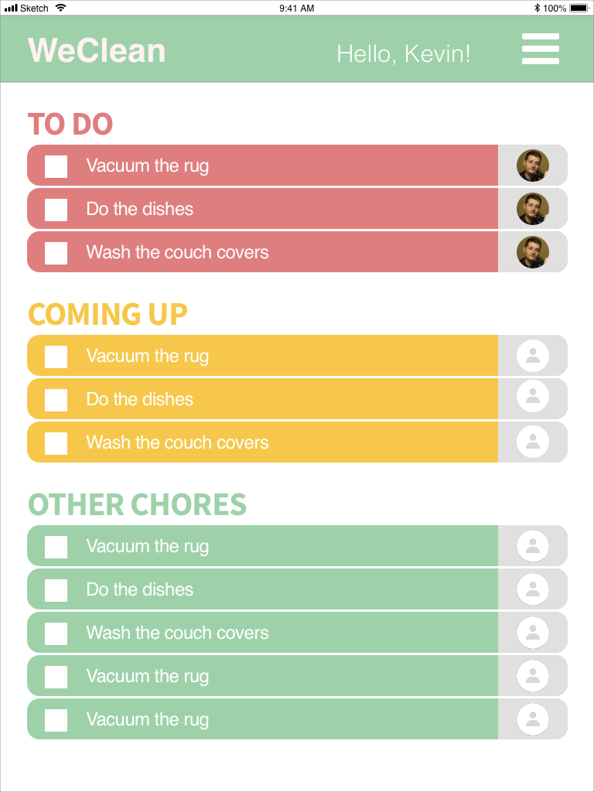
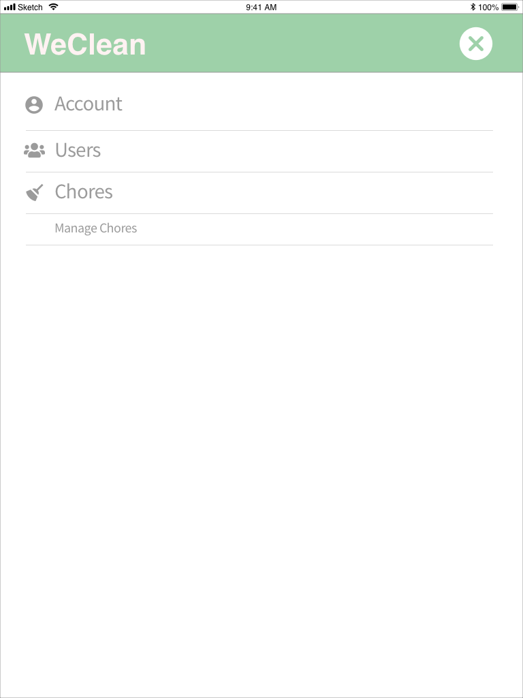
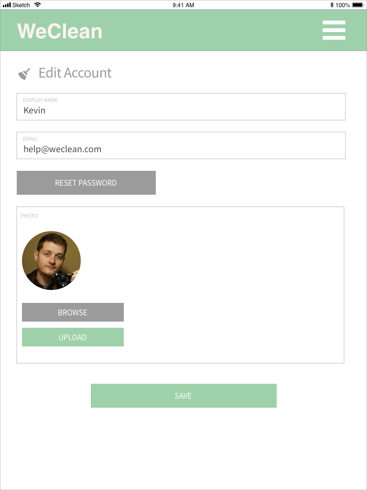
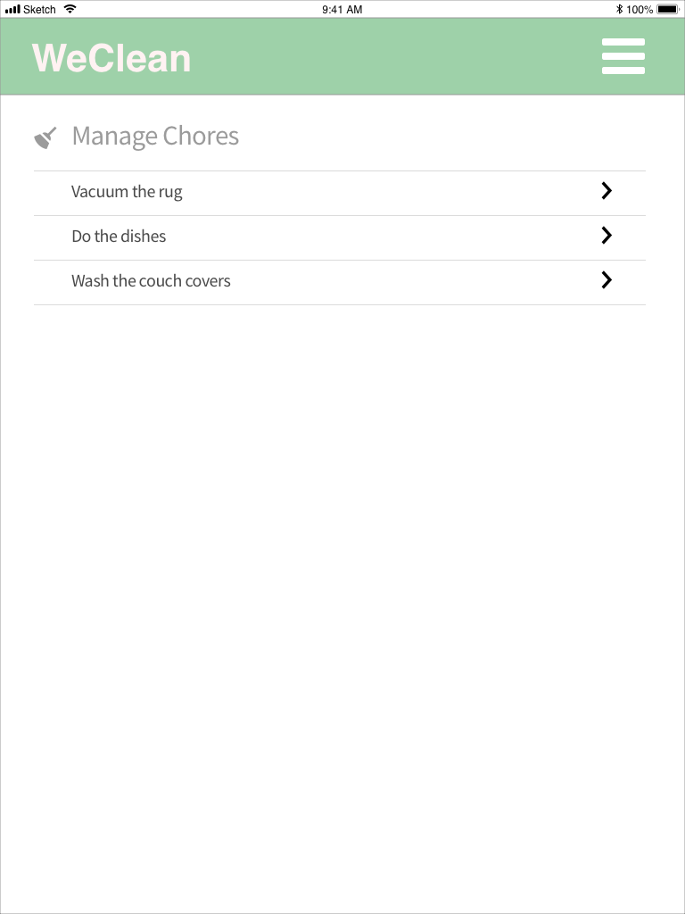
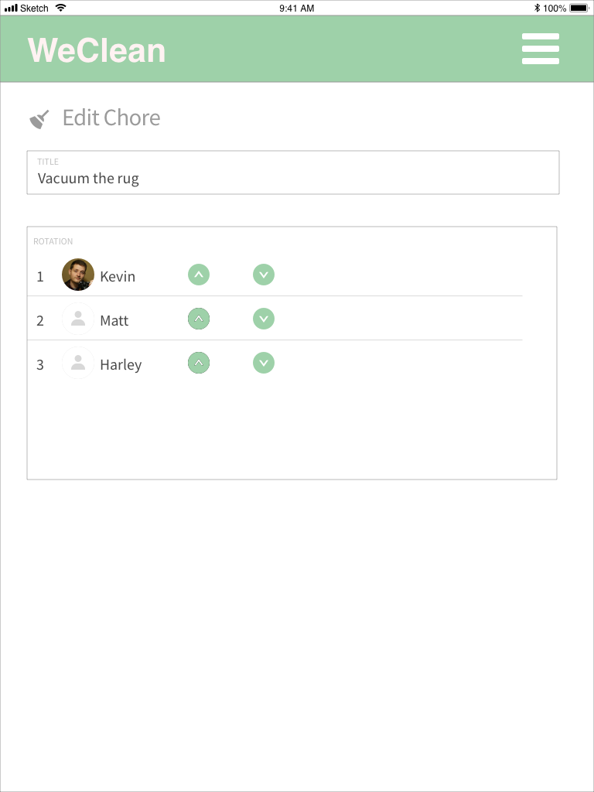
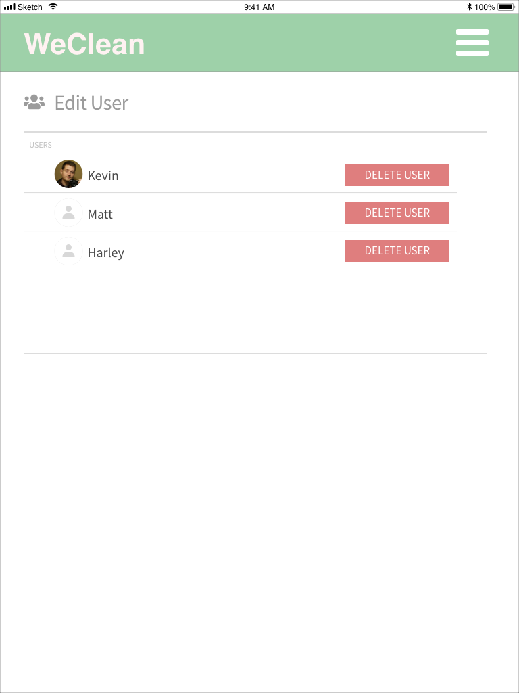

## Planning and Preparation ##

I've been spending a bit of my free time continuing to play around with [Sketch](https://www.sketch.com/), and I continue to really enjoy the software. I think the developers really did an excellent job creating something intuitive and user friendly. 

I have something exciting to share! I have been working on my v1 mockups for the application I'd like to develop called WeClean. I started with some chicken scratch on paper, detailing the capabilities and functionalities I'd like the application to eventually have. I slowly narrowed down the list and have decided that v1 needs to simply include the following functional features...
- Create an account & log in
    - Reset your password
    - Delete a user
- Create a new chore for the group
    - Modify the chore title
    - Rearrange the chore rotation
- Chore visibility
    - View chores assigned to you
    - See upcoming chores that will be assigned to you next
    - View all chores and whom they are assigned to

I'm not sure what backend I'm going to use. My gut is saying I should stick with the [Express](https://expressjs.com/) framework I learned during the Web Developer Bootcamp. I believe I will use [Passport](http://www.passportjs.org/) for all of the authentication pieces, and perhaps just [MongoDB](https://www.mongodb.com/) for database.

## Mockups ##
Here are the mockups I've created using Sketch. I know that you can make it an interactive PDF with clicks, etc. I may consider an interactive PDF mockup for a future iteration of mockups, but I've decided to hold off from it now because I'd like to get started building the app and have realized if I need to take a break that I can switch over to Sketch. In general it's pretty vanilla, but I think it's just the right amount to get it started and using it as a local environment. One obstacle that has occurred to me that I will need to tackle is instancing this design, so that it's valid for multiple specified groups instead of just this one.

Without further ado... here are the V1 mockups! 

Once you click on the bars icon in the top-right, it opens up this __Menu__

Selecting __Account__ from the Menu

Selecting __Manage Chores__ from the Menu

Selecting a specific __Chore__ to edit

Selecting the __Users__ option from the Menu. I've decided to only include the ability to delete a user for now. The admin functionalities will be included later on.
